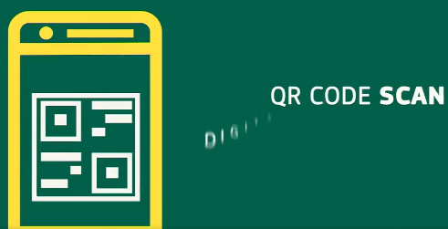

# DigiPass.app
## be sure with [digipass.app](https://www.digipass.app/) 

Test yourself now and share the result!

+ wireless 
+ fast thanks random test technology
+ cheap and online just 1$

[Test yourself now!](https://www.digipass.app/)

A DIGITAL system to identify which passengers have taken a X vaccination is currently in development.

+ vaccine certificates

The idea of requiring proof of * vaccinations surfaced last summer, as a way of kick-starting international travel again without further spreading the virus around the world.

While many hailed the idea as a significant step towards reopening society, it must be said that the passports haven't been popular with everyone.

## BG

## PL

[Jak to robią w EU](EU.md)

[DIGIPASS EU](DIGIPASS-EU.md)

## DE

## EE 

# DigiPass.app

To cyfrowa platforma dla ludzi, którzy przemieszczają się do obszarów ryzyka.
Naszym priorytetem jest przywrócenie branż: lotniczej, podróżniczej, hotelarskiej, restauracji do działania. 

Chcemy w ten sposób pokazać rządom na całym świecie, że kontakt z innymi ludźmi jest bezpieczny, po sprawdzeniu przez aplikację DigiPass.app

Obecnie opracowywany jest CYFROWY system identyfikacji pasażerów, którym podano szczepionkę X.

# IATA

Międzynarodowe Stowarzyszenie Transportu Lotniczego (IATA), które reprezentuje główne linie lotnicze na całym świecie, opracowuje plany wprowadzenia nowej platformy, która będzie używana przez linie lotnicze i na lotniskach na całym świecie.

System, do którego można uzyskać dostęp online, pozwoliłby pasażerom udowodnić, że otrzymali szczepionkę na X, umożliwiając im w ten sposób bezpieczne podróżowanie.

Paszporty szczepień pasażera byłyby cyfrowo powiązane z ich zwykłym paszportem, ale rozumie się, że aby latać na długich dystansach, pasażerowie będą potrzebować obu paszportów.

IATA podkreśla, że taki krok jest konieczny, aby bezpiecznie uruchomić światową branżę turystyczną.

# Rozwiązania

## Jak będzie wdrażna aplikacja DigiPass.app w lotnictwie?

Na razie wiemy tyle, że produkt nie będzie adresowany bezpośrednio do pasażerów, a raczej dla linii lotniczych, które będą oferowały DigiPass.app jako usługę w swoich własnych aplikacjach.

DigiPass.app ma zawierać informację na temat naszego stanu zdrowia, w szczególności kwestii wirusów. 

Znajdzie się tam informacja na temat testów na X, które przeszliśmy, ewentualnego szczepienia, a także wymogi, które musimy spełnić, aby móc bezpiecznie podróżować do danego kraju. 

Po spełnieniu wszelkich wymogów pasażer otrzyma adnotację 

    "Ready to travel"

# DigiPass.app

Poszczególne etapy działania aplikacji możecie zobaczyć poniżej.

Oczywiście, korzystanie z DigiPass.app nie będzie obowiązkowe, jednak z punktu widzenia pasażerów i przewoźników będzie pożądane. 

+ Obecnie wszelkie dokumenty pasażerów są ręcznie sprawdzane przez pracowników linii lotniczych, co zawiera niesamowicie dużo czasu. Jeśli pasażerowie wiedzą z wyprzedzeniem, jakich dokumentów potrzebują, mogą zbierać informacje w aplikacji i po prostu pojawić się na lotnisku. Podróże w ten sposób będą znacznie łatwiejsze – mówi Brad Moore z Qatar Airways.

DigiPass.app

## Zmiana obostrzeń

obecnie ma miejsce nawet 200 aktualizacji dziennie!

Nasza długofalowa wizja zakłada, że pasażerowie będą mogli zrobić wszystko przy użyciu technologii rozpoznawania twarzy: od odprawy przez dostęp do saloniku lotniskowego po sam boarding i wejście na pokład. J

Jedną z największych obaw pasażerów jest kwestia prywatności i ochrony danych osobowych. 

+ Dane na temat stanu zdrowia posiada jedynie pasażer i udostępnia je w momencie, gdy decyduje się na podróż – mówi Hao Yu Dai, wiceprezes linii Singapore Airlines.

+ To absolutnie kluczowa sprawa. Nie ma tu żadnego Wielkiego Brata, a IATA nie ma dostępu do żadnych danych. My po prostu tworzymy mechanizm ułatwiający transfer danych z telefonu pasażera – mówi Hayden.

+ Ryanair, na przykład, konsekwentnie powtarzał, że nie będzie wymagał od pasażerów okazania dowodu szczepienia, argumentując, że robienie tego w przypadku osób podróżujących do miejsc w Europie jest bezcelowe, ponieważ mogą z łatwością odbyć tę samą podróż samochodem, w którym nie ma paszportu szczepionkowego. wymagany. 

+ W zeszłym miesiącu australijskie linie lotnicze Qantas ogłosiły, że będą chciały wdrożyć taki system dla wszystkich swoich pasażerów, aby zagwarantować bezpieczeństwo i integralność granic Australii.

+ Korzystanie z aplikacji nie będzie obowiązkowe, ale przewoźnicy są spokojni o to, że pasażerowie będą korzystali z DigiPass.app

+ Według wiceprezesa Singapore Airlines, ręczna weryfikacja posiadanych dokumentów przed podróżą będzie potrzebna dla 10-20 procent pasażerów.

